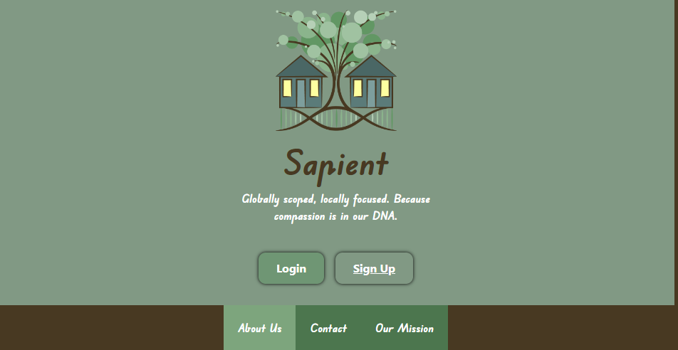
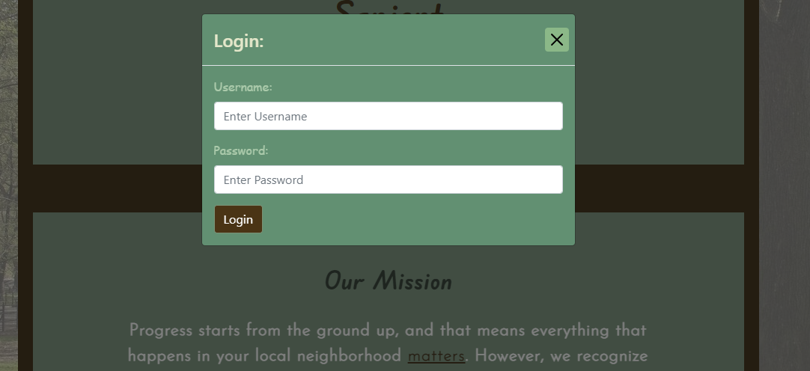
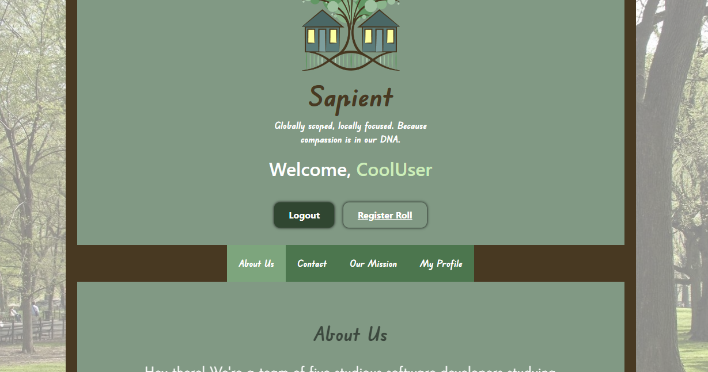
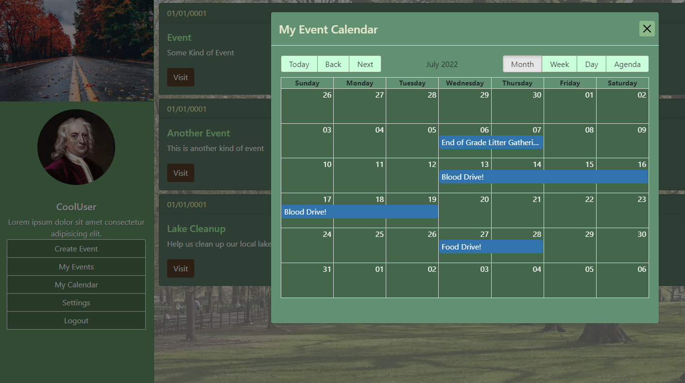

# Sapient

It's no surprise that people want to live in a clean, safe, and friendly environment. However, we don't always get a say in that matter... until now! 

**Welcome to Sapient!** We are a team of five software developers who are passionate about bringing communities together and empowering the average person to do the same.

Our main goal is to provide an intuitive, easy-to-use interface for organizing, participating, and sponsoring local events in your community.

## Motivation

It can be very disheartening to feel helpless in a community that needs your help. Most of us have been in that situation before -- you want to help, you may even know how to, but you don't know where to start. Maybe you have a great idea and you just need some funding, teamwork, or extra labor. Maybe you have absolutely no idea how to contribute but you want to help someone in their mission to do some good. Sapient is here to provide you with critical resources needed to solve these issues.

# Deployment

This project is still in ongoing development, but feel free to visit our deployed application here to reference the time and work we've put in so far!

Here are some snippets of our UI so far:

# Development

Sapient is a collaborative effort brought to you by five software development graduates at [UNC Chapel Hill.](https://www.unc.edu/)

We finished developing the MVP within a very narrow time frame of around 9 days, which met all the goals we initially strived for.

## Technologies

Most of the technologies involved in this project were completely new and unfamiliar to all of us. A good chunk of time spent during our MVP development process was dedicated to learning how to use these new tools, so extra kudos to all of my colleagues for all the amazing strength and intelligence they've shown.

That being said, we developed this application using our very first implementation of the [**MERN Stack.**](https://www.geeksforgeeks.org/mern-stack/) All technologies involved are as follows:

### **Frontend**

- React (18.2.0) - *Framework*
    * @npm: `react-bootstrap`
    * @npm: `react-datepicker`
    * @npm: `react-router-dom`
    * @npm: `react-big-calendar`
* Styled Components - *Styling*
    - @npm: `styled-components`
    - CSS
- GraphQL - *Routing/API*
    * ApolloServer
    * @npm: `@apollo/client`
    * @npm: `graphql`
* JavaScript/JSX - *Programming Languages*

### **Backend**

- Node.js - *Runtime*
- Express.js - *Server Framework*
- ApolloServer - *Routing/API*
    * @npm: `apollo-server-express`
    * @npm: `graphql`
- Bcrypt - *Encryption*
    * @npm: `bcrypt`
- JWT - *Authentication*
    * @npm: `jsonwebtoken`
- NoSQL/Mongoose - *Database*
    * @npm: `mongoose`

Some other technologies worth mentioning are [VSCode](https://code.visualstudio.com/) (code editor), `npx create-react-app` (react boilerplate installer), and `concurrently` (npm package) for testing.

## Challenges

Considering this was our first collaborative effort within a very short time span working with technologies we have never used before, we have faced many challenges. Some of the most prominent ones include:

- File Structure
    * Figuring our react's "do it yourself" mentality for file structure was a daunting task that came back to bite us a lot. Trying to reconcile the need for modularization while also keeping all of our components and utilities maintainable was very difficult.
- Styling
    * We did not anticipate how difficult it would be to locally style components while also implementing themes and other globally-scoped styling rules. Our first attempt was using CSS modules but we eventually switched to using `styled-components` which yielded a much nicer result.
- Deadline
    * Working under a strict deadline
- Multi-tasking
    * Almost none of us were full-time on this project and we all had other very important duties to attend to.

## Successes

Despite our challenges, we are very proud of the successes we achieved over the duration of this project. Some of our greatest moments include:

* Learning!
    - I cannot overstate how much we all learned from working together in this incredibly stressful and foreign environment. We not only learned many things about the tools we were using, but we also learned more about each other as group mates which was a wonderful experience.
* Communication 
    - We were incredibly efficient and highly adaptive due to excellent communication. Everybody remained respectful and only had the best interest of everyone in mind all of the time. Great team.
* GraphQL Requests
    - One of our biggest struggles was also one of our best successes -- working with GQL. This was a hard tool to adapt to at first, but we picked up on it very quickly.
* Routing
    - With react being a single-page application, routing seemed difficult at first. Especially when considering redirection and query parameters. However, we quickly adapted to this concept with the help of React's router-dom library.
* Database
    - We were very proud of having a working database upon our application's initial deployment!

# Contributors

This project was made possible by our lovely contributors:

- **James Primitive**
    * Programming, Event Page, UI design, Technology integrator, Idea communicator
    * *@github:* https://github.com/PrimitiveJ
- **Kaylan Prophet**
    * Styling, Landing Page, Programming
    * *@github:* https://github.com/KaylanProphet
* **Zac Eitel**
    - User Page, UI design, Programming, Overall app idea, Idea communicator
- **Mason Morris**
    * Event Creation Page, Idea communicator, Programming
* **William Horn**
    - UI design, Programming, Landing Page
    * *@github:* https://github.com/william-horn

Shout out to these wonderful people for coming together and making this hard work pay off in more ways than one.

# Contacts

All inquiries can be sent to: williamjosephhorn@gmail.com
